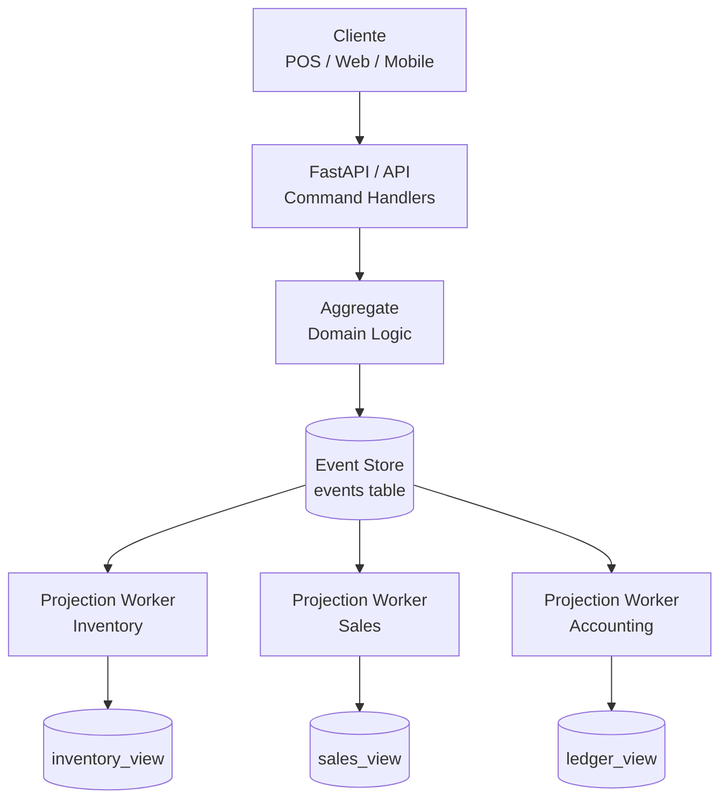

Este exemplo mostra **a história de uma manhã de produção e venda em uma padaria** registrada em um **event log append-only** no PostgreSQL.





O sistema usa três tabelas de infraestrutura:

**events**: log / fila de eventos  
**projection_checkpoints**: controle de consumidores  
outbox: integração externa
### Tabela `events`
A sequência abaixo descreve o início da manhã de produção de pão francês, sua venda no balcão e o registro financeiro correspondente. Log imutável (*Append-only*).
```bash
| global_pos | aggregate  | id      | ver | event_type        | payload (resumo)                          |
|-------------|------------|---------|-----|------------------|--------------------------------------------|
| 1           | Product    | P001    | 1   | ProductCreated    | Produto criado: Pão Francês, preço 0.80    |
| 2           | Ingredient | I001    | 1   | IngredientCreated | Ingrediente criado: Farinha, unidade kg    |
| 3           | Stock      | I001    | 1   | StockAdded        | Entrada estoque: 50kg farinha              |
| 4           | Production | B-1001  | 1   | DoughPrepared     | Massa preparada: 10kg farinha → 120 pães   |
| 5           | Production | B-1001  | 2   | BreadBaked        | Lote assado: 120 pães franceses            |
| 6           | Inventory  | P001    | 1   | StockIncreased    | Estoque produto +120 unidades              |
| 7           | Sale       | S001    | 1   | SaleRegistered    | Cliente compra 6 pães no balcão            |
| 8           | Inventory  | P001    | 2   | StockDecreased    | Estoque produto -6 unidades                |
| 9           | Payment    | S001    | 1   | PaymentReceived   | Pagamento em dinheiro R$4.80               |
| 10          | Accounting | TX001   | 1   | RevenueRecorded   | Receita registrada da venda S001           |
```
### projection_checkpoints
Cada projeção do sistema lê a fila de eventos e mantém seu próprio ponto de progresso.

```bash
projection_name        last_position
sales_projection       10
inventory_projection   8
accounting_projection  10
analytics_projection   7
```

``sales_projection``  já processou todos os eventos da venda e ``inventory_projection``  ainda precisa processar o evento 9 e 10

### outbox
A tabela outbox serve para integração com sistemas externos.

```bash
id | topic              | payload
1  | sale.created       | {"sale_id":"S001","items":6,"total":4.80}
2  | payment.received   | {"sale_id":"S001","method":"cash","amount":4.80}
```

Possíveis consumidores:
- serviço de analytics  
- sistema fiscal  
- dashboard gerencial  
- notificação de vendas

> [!INFO]
>  **Estado atual**
>  estoque pão francês = 114
>  receita total = R$4.80
>  lotes produzidos = 1
	
 ### 3. Comportamento dos Consumidores (Projeções)
Pseudo Codigo:

```bash
checkpoint = load_checkpoint()

events = SELECT *
         FROM events
         WHERE global_position > checkpoint
         ORDER BY global_position
         LIMIT 100

for event in events:
    handle_if_relevant(event)

checkpoint = last_event.global_position
save_checkpoint(checkpoint)
```

> [!IMPORTANT]
>O checkpoint só deve ser atualizado **depois do processamento completo**.

**Módulo de Estoque** (``Projection Worker Inventory``)
Responsável por manter o estado atual do inventário. Escuta eventos relacionados a movimentação de produtos:
``StockAdded`` ,  ``StockIncreased`` , ``StockDecreased`` e ``BreadBaked``

A partir desses eventos ele atualiza a tabela``inventory_view``

**Módulo de Vendas** (`Projection Worker Sales`)  
Responsável por manter o **histórico e o estado das vendas**.

Escuta eventos:

`SaleRegistered`, `PaymentReceived`

Atualiza a tabela:

`sales_view`

---

**Módulo Financeiro** (`Projection Worker Accounting`)  
Responsável por manter o **registro contábil das receitas**.

Escuta eventos:

`PaymentReceived`, `RevenueRecorded`

Atualiza a tabela:

`ledger_view`


> [!INFO]
>  Cada projeção lê a **mesma fila global de eventos (`events`)**, mas mantém seu próprio progresso através da tabela: `projection_checkpoints` . Isso permite que novos consumidores sejam criados posteriormente (por exemplo, um módulo de BI) simplesmente **reprocessando o log desde `global_position = 1`**.

